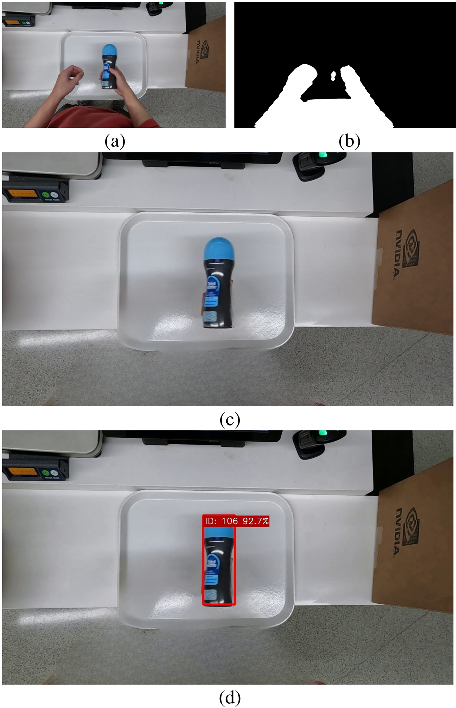

# PersonGONE: Image Inpainting for Automated Checkout Solution
Official implementaion by authors.
Team 117 - Graph@FIT

Proposed solution for [_AI City Challenge 2022_](https://www.aicitychallenge.org/) Track4: _Multi-Class Product Counting & Recognition for Automated Retail Checkout_



Paper to [download](https://openaccess.thecvf.com/content/CVPR2022W/AICity/html/Bartl_PersonGONE_Image_Inpainting_for_Automated_Checkout_Solution_CVPRW_2022_paper.html)
### Note: This is a modifed repository for education purposes. Go to https://github.com/BUT-GRAPH-at-FIT/PersonGONE to see original repository. 
### Tested environment

* WSL2 Ubuntu 22.04
* Python 3.8.18
* CUDA 11.3
* CuDNN 8.2.1 (?)
* PyTorch 1.11
* Nvidia GeForce RTX 3050 Mobile

## Environment setup
1. Clone repo
```bash
git clone https://github.com/ddvinh1/pgone_repo.git
```
2. Setup environment
```bash
conda create -n pgone python=3.8 -y
conda activate pgone
cd <path/to/repo>
```
3. Install dependencies
```bash
pip install torch==1.11.0+cu113 torchvision==0.12.0+cu113 torchaudio==0.11.0+cu113 -f https://download.pytorch.org/whl/cu113/torch_stable.html
#conda install cudatoolkit=11.3 cudnn -c pytorch -c conda-forge #only run this line if the code doesn't work
pip install Cython
pip install pycocotools
pip install mmcv-full==1.4.6 -f https://download.openmmlab.com/mmcv/dist/cu113/torch1.10.0/index.html
pip install -r requirements.txt
```

4. Set environment variables
```bash
export PERSON_GONE_DIR=$(pwd)
```

## Reproduce results with pre-trained detector (prefered)

### Prepare testing dataset
If you do not want to train detector, only ``AIC22_Track4_TestA.zip`` (or TestB) is sufficient.

```bash
export TRACK_4_DATA_ROOT={/path/to/track_4/root_dir/test_data}
```

For example: ``export TRACK_4_DATA_ROOT=/mnt/c/Vinh/pgone_repo/test_data``
Which "test_data" is folder where you put your test video "testA_1", "testA_2", etc. and "video_id.txt" 

### Download pre-trained model
```bash
cd $PERSON_GONE_DIR
python download_pretrained_models.py --detector
```
This will download LaMa, DetectoRS, HTC, PointRend, YOLOX-L and YOLACT model (approx. 3GB)
Alternatively, you may [train detector at your own](#training-ref)

### Inpainting process
Run:
```bash
python inpainting_process.py --video_id $TRACK_4_DATA_ROOT/video_id.txt
```
``video_id.txt`` file is available in ``AIC22_Track4_TestA`` and contain video IDs and video file names (in the same directory)

### Detect ROI
Run:
```bash
python detect_ROI.py --video_id $TRACK_4_DATA_ROOT/video_id.txt
```
Arguments ``--roi_seed`` can be set (two values) - it specifies seed position for ROI detection (white tray) in format ``x y``

### Detect products and create submission
Run:
```bash
python detect_and_create_submission.py --video_id $TRACK_4_DATA_ROOT/video_id.txt
```
Parameters ``--tracker`` and ``--img_size`` can be set. The values are pre-set to ``tracker = BYTE, img_size = 640``

### Hint
All scripts are set as the result was reported to _AI City Challenge_ and no arguments must be set (only ``--video_id``).


## Train object detector for store checkout<a name="training-ref"></a>

### Prepare _AI City Challenge_ dataset<a name="prepare-dataset-ref"></a>
If you want to train detector prepare data at least from Track1, Track3, and Track4 (_AI City Challenge 2022_)  


#### Transform data structure - separate data by classes
```bash
cd $PERSON_GONE_DIR
cp split_data.sh Track4/Train_SynData/segmentation_labels/split_data.sh
cd Track4/Train_SynData/segmentation_labels
bash split_data.sh

cd $PERSON_GONE_DIR
cp split_data.sh Track4/Train_SynData/syn_image_train/split_data.sh
cd Track4/Train_SynData/syn_image_train
bash split_data.sh
```
### Train detector (can take many hours/several days)
1. Download pretrained-model models without detector  
```bash
python download_pretrained_models.py
```
2. Prepare _AI City Challenge_ dataset as [described above](#prepare-dataset-ref)
3. Create dataset
```bash
python create_dataset.py --t_1_path {/path/to/AIC22_Track_1_MTMC_Tracking} --t_3_path {/path/to/AIC22_Track3_ActionRecognition} --t_4_track {/path/to/AIC_Track4/Train_SynData}
```
4. Train detector
```bash
python train_detector.py  
```
Arguments ``--batch_size`` and ``--epochs`` can be set. Explicit values are ``batch_size = 16, epochs = 75``.


## Acknowledgements
* Instance segmentation: [MMdetection](https://github.com/open-mmlab/mmdetection)
* Inpainting: [LaMa](https://github.com/saic-mdal/lama)
* Detector: [YOLOX](https://github.com/Megvii-BaseDetection/YOLOX)
* Trackers: [BYTE](https://github.com/ifzhang/ByteTrack), [SORT](https://github.com/abewley/sort)

## Citation

```
@InProceedings{Bartl_2022_CVPR,
    author    = {Bartl, Vojt\v{e}ch and \v{S}pa\v{n}hel, Jakub and Herout, Adam},
    title     = {PersonGONE: Image Inpainting for Automated Checkout Solution},
    booktitle = {Proceedings of the IEEE/CVF Conference on Computer Vision and Pattern Recognition (CVPR) Workshops},
    month     = {June},
    year      = {2022},
    pages     = {3115-3123}
}
```

<!--
# TODOs:
Nastavit spravne velikosti datasetu a epochy tranovani (ted jen na zkousku)  
Zkontrolovat nazvy a sjednotit nazvy jako _AIC22_Track4_TestA, AIC22_Track_1_MTMC_Tracking_ s oficialne stazenymi soubory
-->
